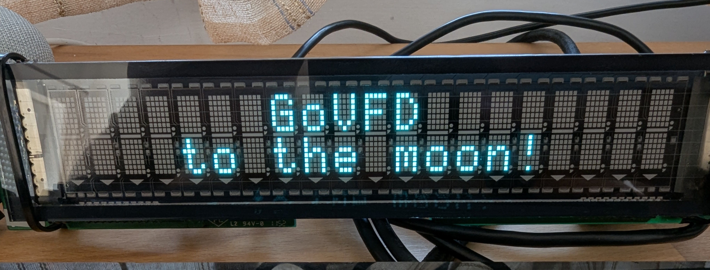

#  GoVFD - Smart VFD Display Library for Go



[](https://golang.org/)
[](LICENSE)

---

##  **Key Features**

###  **Smart Latin Encoding**

- ** ZERO charset configuration** - just send UTF-8 text! (no emoji support for obvious reasons)
- ** Automatic character set detection** for Latin scripts
- ** Latin language support** - Portuguese, Spanish, French, German, Italian
- ** Optimized performance** - focused on what actually works

###  **Model-Based Architecture**

- ** Automatic setup** for supported VFD models
- ** Multiple command protocols** (ESC/POS, custom protocols)
- ** Easy extensibility** for new models

###  **Complete Control**

- Cursor positioning, brightness, blinking
- Form feed, clear screen, self-test
- Raw byte access for advanced users

---

##  **The Magic in Action**

### Before GoVFD (The Old Way) 

```go
// Manual charset management nightmare!
display.SetCharacterCodeTable(16)  // What is 16? Who knows!
rawBytes := []byte{0x43, 0x61, 0x66, 0xE9}  // Manual encoding
display.WriteRawBytes(rawBytes)    // Hope it works...
```

### With GoVFD (The New Way) 

```go
// Just works! Zero configuration!
display.WriteText("Café")          //  Perfect French!
display.WriteText("ação")          //  Perfect Portuguese!
display.WriteText("niño")          //  Perfect Spanish!
display.WriteText("Müller")        //  Perfect German!
```

---

##  **Smart Latin Encoding System**

```
┌─────────────────────────────────────────────────────────────┐
│                     SMART LATIN ENCODING                    │
├─────────────────────────────────────────────────────────────┤
│    Input: Latin UTF-8 Text ("Café", "ação", "€uro")         │
└─────────────────────┬───────────────────────────────────────┘
                      │
┌─────────────────────▼───────────────────────────────────────┐
│                 STEP 1: Try Current Charset                 │
│     Success? → Send to display immediately                  │
│     Failed?  → Continue to detection...                     │
└─────────────────────┬───────────────────────────────────────┘
                      │
┌─────────────────────▼───────────────────────────────────────┐
│             STEP 2: Auto-Detect Best Charset                │
│  • Portuguese chars (ã,ç,õ) → CP860                         │
│  • Euro symbol (€)          → CP858                         │
│  • General Latin (é,ñ,ü,ö)  → CP850                         │
│  • Default fallback         → CP437                         │
└─────────────────────┬───────────────────────────────────────┘
                      │
┌─────────────────────▼───────────────────────────────────────┐
│             STEP 3: Hardware Charset Switching              │
│  Automatically sends ESC commands to switch display charset │
│     Success? → Perfect native encoding!                     │
│     Failed?  → Use as-is (ASCII safe)                       │
└─────────────────────┬───────────────────────────────────────┘
                      │
┌─────────────────────▼───────────────────────────────────────┐
│                     Perfect Display Output                  │
│           Latin characters display correctly!               │
└─────────────────────────────────────────────────────────────┘
```

---

##  **Installation**

```bash
go get github.com/corrreia/govfd
```

---

##  **Quick Start Guide**

###  **Basic Usage (Recommended)**

```go
package main

import (
    "log"
    "github.com/corrreia/govfd"
    "github.com/corrreia/govfd/types"
)

func main() {
    // 🎉 One line to connect - model handles all configuration!
    display, err := govfd.OpenModel("COM3", types.ModelEpsonDMD110)
    if err != nil {
        log.Fatal("Connection failed:", err)
    }
    defer display.Close()

    //  Just send text - encoding is automatic!
    display.Clear()
    display.SetCursor(1, 1)
    display.WriteText("Café français")  // Perfect accents!

    display.SetCursor(1, 2)
    display.WriteText("ação €uro")      // Portuguese + Euro symbol!

    //  Other controls work as expected
    display.SetBrightness(3)
    display.SetBlink(500) // Blink every 500ms
}
```

###  **Latin Character Examples**

```go
// 🇵🇹 Portuguese
display.WriteText("São Paulo, ação, coração")

// 🇪🇸 Spanish
display.WriteText("Niño, español, corazón")

// 🇫🇷 French
display.WriteText("Café, naïve, résumé")

// 🇩🇪 German
display.WriteText("Müller, Zürich, größe")

// 🇮🇹 Italian
display.WriteText("città, università, così")

//  Euro symbol
display.WriteText("€19.99")
```

---

##  **Supported Hardware**

###  **VFD Models**

| Model                 | Dimensions | Baud Rate | Protocol | Auto-Config |
| --------------------- | ---------- | --------- | -------- | ----------- |
| **Epson DM-D110**     | 20×2       | 9600      | ESC/POS  | Active      |
| _(More coming soon!)_ |            |           |          |             |

### 🔌 **Command Protocols**

| Protocol             | Description              | Character Sets | Status    |
| -------------------- | ------------------------ | -------------- | --------- |
| **ESC/POS**          | Standard ESC/POS for VFD | Latin charsets |    Active |
| _(Custom protocols)_ | Extensible architecture  |                |    Future |

---

##  **Advanced Usage**

###  **Custom Configuration**

```go
// Override model defaults
opts := &govfd.Options{
    BaudRate: 19200,  // Use different baud rate
    DataBits: 7,      // Different data bits
}
display, err := govfd.OpenModelWithOptions("COM3", types.ModelEpsonDMD110, opts)

// Manual configuration (for unsupported models)
opts := &govfd.Options{
    BaudRate: 9600,
    DataBits: 8,
    Parity:   serial.NoParity,
    StopBits: serial.OneStopBit,
    Columns:  20,
    Rows:     2,
}
display, err := govfd.Open("COM3", opts)
```

###  **Display Controls**

```go
// Screen management
display.Clear()           // ESC @ (initialize)
display.FormFeed()        // Form feed (0x0C)

// Cursor control
display.SetCursor(5, 2)   // Move to column 5, row 2 (1-based)
col, row := display.GetCursor()

// Visual settings
display.SetBrightness(4)  // Brightness 1-4
display.SetBlink(1000)    // Blink every 1000ms (0=off)

// Information
cols, rows := display.Dimensions()
brightness := display.GetBrightness()

// Diagnostics
display.SelfTest()        // Execute hardware self-test
```

###  **Raw Access (Advanced Users)**

```go
// Send raw bytes (bypasses smart encoding)
rawData := []byte{0x1B, 0x40}  // ESC @ command
display.WriteRawBytes(rawData)

// For implementing custom protocols or commands
```

---

##  **Interactive CLI Demo**

Try the interactive command-line interface to test all features:

```bash
go run examples/cli-example.go
```

###  **CLI Commands**

```
> help                          # Show all commands
> text Café français           # Send text (automatic encoding!)
> pos 10 2                     # Move cursor to column 10, row 2
> bright 3                     # Set brightness to level 3
> blink 500                    # Set cursor blink to 500ms
> clear                        # Clear screen
> selftest                     # Run hardware self-test
> models                       # List supported models
> info                         # Show current model info
```

** Try typing international characters - they just work!**

---

##  **Complete API Reference**

###  **Connection Management**

```go
// Model-based (recommended)
display, err := govfd.OpenModel(portName, modelType)
display, err := govfd.OpenModelWithOptions(portName, modelType, options)

// Manual configuration
display, err := govfd.Open(portName, options)

// Cleanup
display.Close()
```

###  **Text Output**

```go
// Smart encoding (recommended)
err := display.WriteText("Any UTF-8 text!")

// Raw bytes (advanced)
err := display.WriteRawBytes([]byte{0x48, 0x65, 0x6C, 0x6C, 0x6F})
```

###  **Cursor & Screen**

```go
// Positioning
err := display.SetCursor(column, row)  // 1-based (starts @ 1, not 0)
col, row := display.GetCursor()

// Screen control
err := display.Clear()        // Initialize display
err := display.FormFeed()     // Clear screen content
```

###  **Visual Settings**

```go
// Brightness (1-4)
err := display.SetBrightness(level)
level := display.GetBrightness()

// Cursor blinking
err := display.SetBlink(intervalMs)  // 0 = off
interval := display.GetBlinkMs()
```

### **Information & Diagnostics**

```go
// Display info
cols, rows := display.Dimensions()

// Hardware test
err := display.SelfTest()

// Model information
models := govfd.GetSupportedModels()
profile, exists := govfd.GetModelProfile(types.ModelEpsonDMD110)
protocols := govfd.GetSupportedProtocols()
```

---

##  **Architecture & Extending**

###  **Project Structure**

```
govfd/
├──  commands/escpos/       # ESC/POS protocol implementation
│   ├── encoding.go         # Smart encoding system :)
│   ├── commands.go         # Command implementations
│   ├── chartable.go        # Character set constants
│   └── consts.go           # ESC/POS constants
├──  models/epson/          # Model-specific configurations
├──  types/                 # Type definitions
├──  examples/              # Example applications
├── govfd.go                # Main library interface
├── display.go              # Display control functions
├── models.go               # Model registry
└── protocols.go            # Protocol interface
```

###  **Adding New Models**

```go
// 1. Define model specification
var MyModelSpec = ModelSpec{
    Name: "My VFD Model",
    Manufacturer: "VFD Corp",
    Columns: 16,
    Rows: 2,
    DefaultBaudRate: 9600,
    CommandProtocol: types.ProtocolESCPOS,
    // ... other settings
}

// 2. Register in models.go
var modelRegistry = map[types.Model]*ModelProfile{
    types.ModelMyVFD: {
        // Map from spec...
    },
}
```

###  **Custom Command Protocols**

Custom protocols dontr need to work only via serial, need to think better how i will implement that.

```go
// Implement the Protocol interface
type MyProtocol struct{}

func (p *MyProtocol) GetName() string { return "MyProtocol" }
func (p *MyProtocol) WriteText(text string) []byte { /* implementation */ }
func (p *MyProtocol) Clear() []byte { /* implementation */ }
// ... implement other methods
```

---

##  **Contributing**

We welcome contributions! Here's how to help:

###  **Reporting Issues**

- Use GitHub Issues
- Include model, OS, and code examples
- Describe expected vs actual behavior

###  **Contributing Code**

1. Fork the repository
2. Create feature branch (`git checkout -b feature/amazing-feature`)
3. Commit changes (`git commit -m 'Add amazing feature'`)
4. Push to branch (`git push origin feature/amazing-feature`)
5. Open Pull Request
6. Huge Thanks! Its really hard come by new VFD's

###  **Development Setup**

```bash
git clone https://github.com/corrreia/govfd.git
cd govfd
go mod tidy
go test ./...
go build ./...
```

---

##  **License**

This project is licensed under the MIT License - see the [LICENSE](LICENSE) file for details.

---

<div align="center">

### **Made with ❤️ for the Go community**

**[ Documentation](https://pkg.go.dev/github.com/corrreia/govfd)** •
**[ Issues](https://github.com/corrreia/govfd/issues)** •
**[ Discussions](https://github.com/corrreia/govfd/discussions)**

</div>
